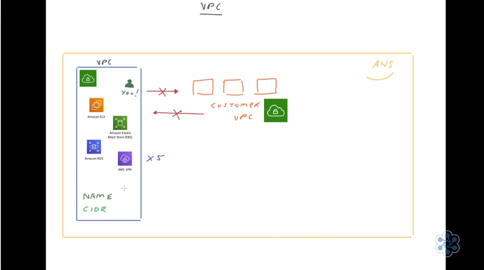
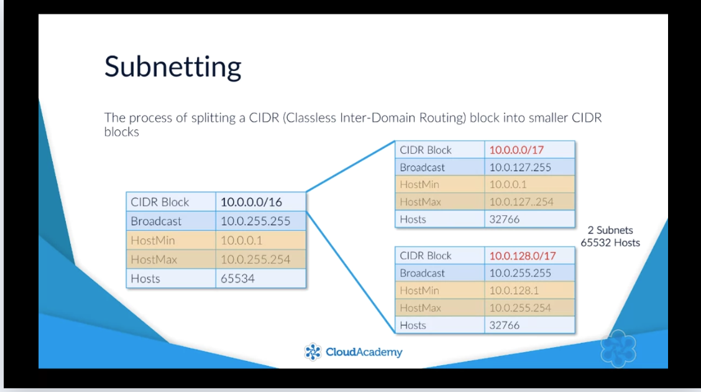
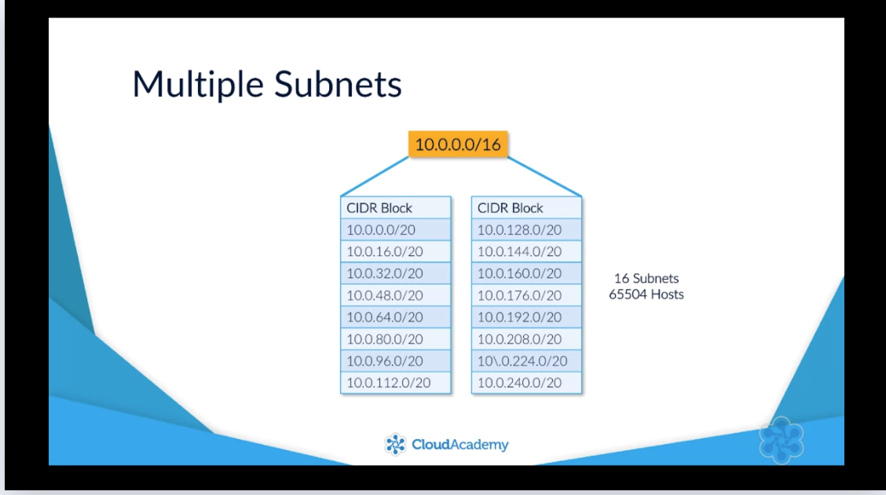
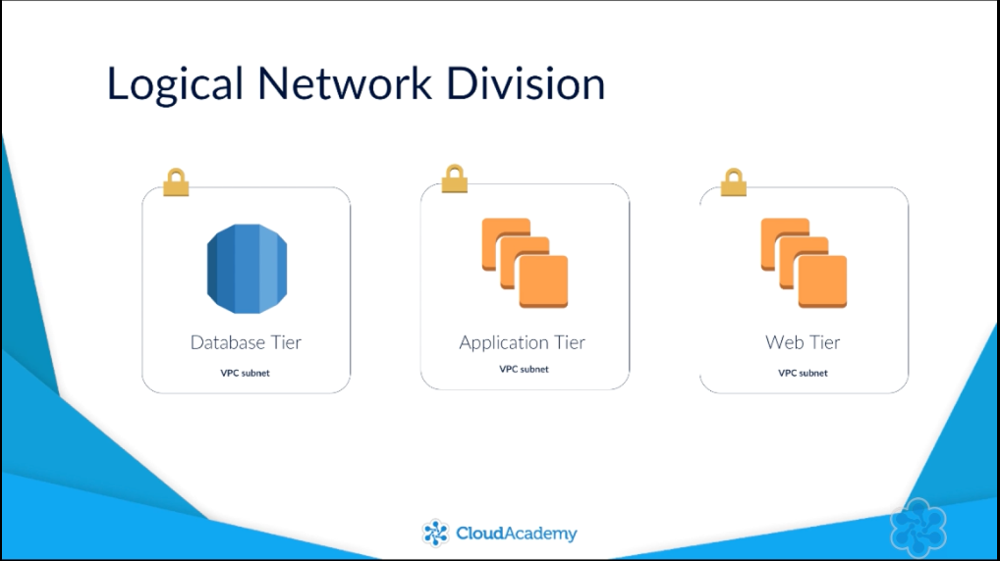
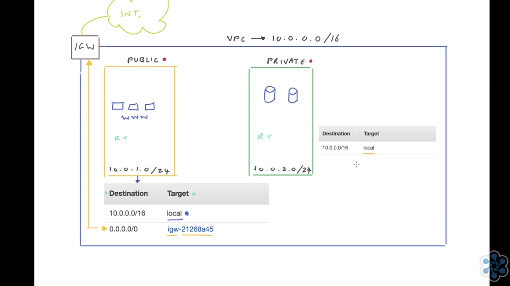
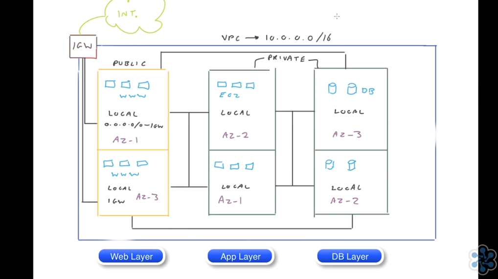
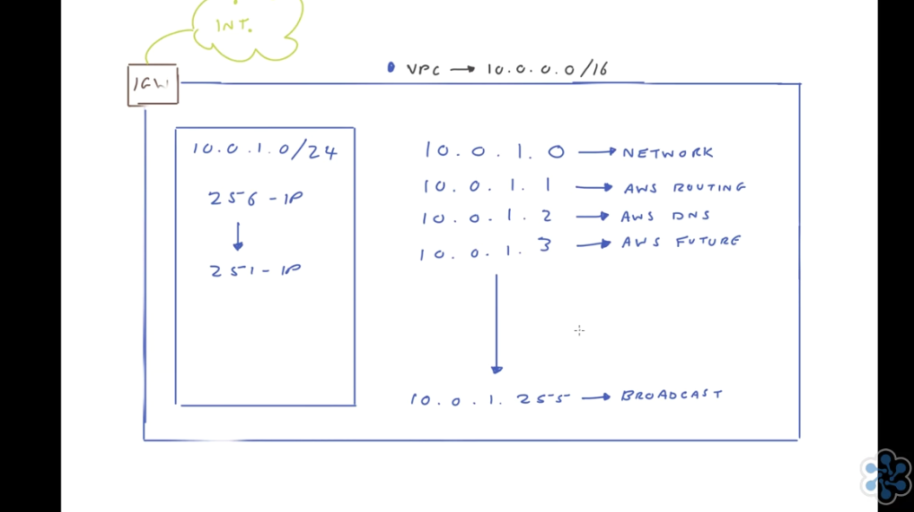

## VPC

A [VPC](https://cloudacademy.com/course/amazon-vpc-networking/vpc-introduction/) resides inside of the AWS Cloud and it's essentially your own isolated segment of the AWS Cloud itself, so here is your VPC sitting inside the AWS Cloud. 

Now by default when you create your VPC, the only person that has access to this is your own AWS account, just you. It is totally isolated and no one else can gain access to your VPC other than your own AWS account. Now obviously there are millions upon millions of other VPCs within the AWS network created by other customers all across the world. So, there are millions of customer VPCs. However, they do not have access to your VPC and likewise, you do not have access to their VPC. 

Now what do you use a VPC for? Well, essentially it allows you to start deploying resources within your VPC, for example, different compute resources or storage or database and other network infrastructure among others and this allows you to start building and deploying your solutions within the Cloud. 

Now by default from a limitation perspective, you are allowed up to five VPCs per region per AWS account and it's very simple to create a VPC. All you need to do is to give it a name, when you create your VPC and also define an IP address range that the VPC can use and this is done in the form of a CIDR block which stands for Classless Inter-Domain Routing. And I'll talk more about that when I talk more about subnets in a few minutes. 

So, just to recap at a high level, simply put, a VPC is an isolated segment of the AWS public cloud that allows you to provision and deploy resources in a safe and secure manner. I now want to dive deeper into the VPC architecture and start talking about subnets and how you can segment your VPC out into different areas across multiple availability zones for resiliency and high availability, so let's take a look.

## Subnets

[VPC TCP/IP Addressing](https://cloudacademy.com/course/aws-virtual-private-cloud-subnets-and-routing/vpc-cidr-blocks/)

For example let's say you had a CIDR block range of 10.0.0.0/16. Which as itself gives you the following network details.

This is a large IP range to have as a single network as it allows for up to 65,534 hosts. To make better use of this range and to create smaller networks allowing segmentation within your network you could subnet the CIDR block into smaller CIDR ranges using a different subnet mask, such as /17 for each subnet.

This would provide you with two different subnets with CIDR block ranges of 10.0.0.0/17 and black 10.0.128.0/17 providing the same range of host addresses minus the network and broadcast addresses for each subnet of course. You can see this by comparing the HostMin and HostMax entries between the three CIDR blocks.

Should you require more than just the two subnets which is likely than you can obviously split the original CIDR block further giving you more than just the two subnets I listed. For example, if I wanted 16 different subnets than I could subnet the CIDR block 10.0.0.0/16 by using a subnet mask of /20 for each subnet which would provide me with the following subnets

For AWS to configure your VPC appropriately, AWS reserves five IP addresses in each subnet. These IP addresses are used for routing, Domain Name System (DNS), and network management.

**Why Subnet your VPCs**

Every time you create a subnet, it is a private subnet to begin with and that is until you attach an Internet gateway to your VPC and then add this additional route. 

If we have 3 subnets this time:
Public and 2 private subnets.
We have six subnets for the 3 different services, Web Infrastructure, App Layer and Database Layer, thus 2 Availability zones for each.

Let's imagine AZ-1 experienced a failure. So what would happen here? This public subnet would be out of action. This application subnet and that is it. So in this situation, we still have one subnet available in each layer of our infrastructure. So should we experience a failure with availability zone one, our services will remain up and running.

# VPC SECURITY
## Network Access Control Lists(NACLs)

