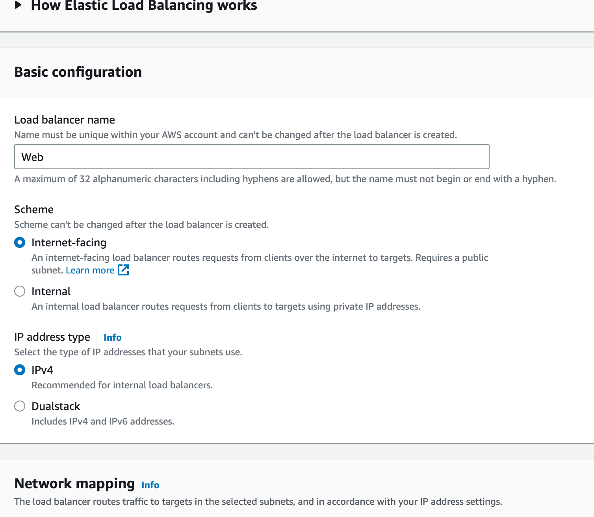
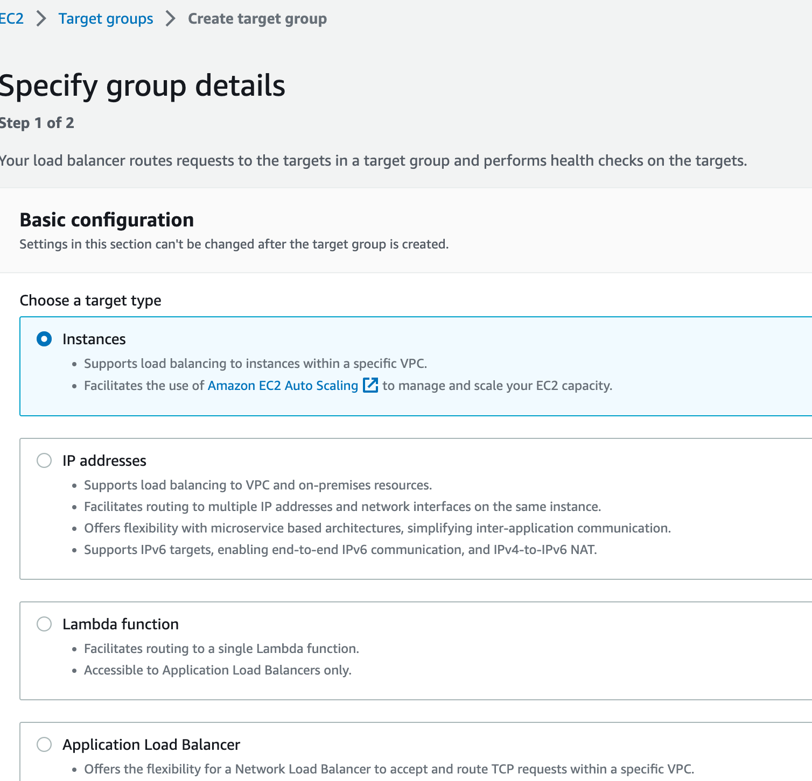

# AutoScaling and Elastic Load Balancer.

The Launch Template essentially contains the blueprint or DNA for the exact type of instance that should be launched. Hence, when auto-scaling, each instance is guaranteed to be just like the last one. It's repeatable, scalable, and reliable.
